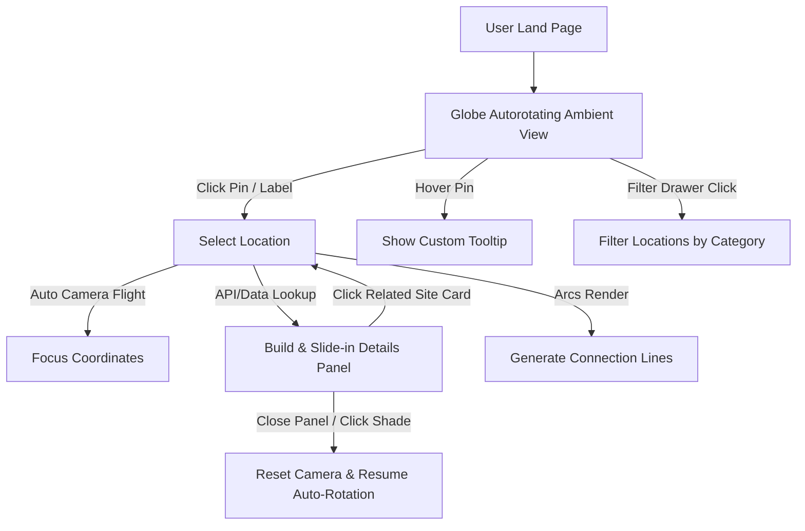

# ◈ Terra Obscura — Ancient Knowledge Archive ◈

[](https://opensource.org/licenses/MIT)
[](https://threejs.org/)
[](https://github.com/vasturiano/globe.gl)
[](style.css)

An immersive, interactive 3D globe visualization archiving ancient mysteries, lost civilizations, and sacred, mythological, and megalithic sites scattered across the Earth. 

Designed with a sleek, dark, gold-accented museum aesthetic, **Terra Obscura** bridges the gap between historical scholarship and cinematic digital interaction.

---

## ✦ Table of Contents

- [Overview & Concept](#-overview--concept)
- [Key Features](#-key-features)
- [Visual Experience & Styling](#-visual-experience--styling)
- [System Architecture & File Structure](#-system-architecture--file-structure)
- [Tech Stack](#-tech-stack)
- [Getting Started & Local Hosting](#-getting-started--local-hosting)
- [Data Schema (How to Add Sites)](#-data-schema-how-to-add-sites)
- [Interactions & Logic Flow](#-interactions--logic-flow)
- [License](#-license)

---

## ◈ Overview & Concept

**Terra Obscura** is a portal into the past. In a world of satellite mapping and modern street views, this application strips back the present to reveal the global network of ancient structures, mythological sites, and unsolved archaeological anomalies.

Users can spin the globe, filter through curated categories of historical interest, and dive deep into detailed archival records. Each record compiles verified historical data, local folklore/lore, unresolved structural mysteries, and maps the direct cultural or spatial relationships between different sites.

---

## ✦ Key Features

### 1. Interactive 3D Globe Viewport
- **High-Fidelity Rendering:** Powered by `Globe.gl` and `Three.js` using night-sky background, high-resolution topology bumps, and night-lights textures.
- **Custom-Engineered Pins:** Dynamic 3D pins generated programmatically using custom Three.js meshes (a torus base, cylinder needle, color-coded glass-like neck, sphere head, and additive glow-blending sprite texture).
- **Ripple Rings:** Pulsing rings project outwards from each pin to denote activity and draw focus.

### 2. Multi-Dimensional Detail Panel
- **Cinematic Hero Headers:** Dynamic image loading (curated local imagery or contextualized keyword requests) topped with custom colored glow-bars corresponding to the location category.
- **Narrative Content Split:** Clean separation between:
  - **Archive Entry:** Verified historical, geological, or architectural context.
  - **Lore & Legend:** Local folklore, mythologies, and ancient tales.
  - **Unsolved:** The active mysteries, anomalies, or excavations keeping modern archaeologists up at night.
- **Connected Topics & Tags:** Interactive metadata tagging that classifies details.
- **Relational Navigation:** Clickable cards of related discoveries that seamlessly transition the globe view to the selected site.

### 3. Spatial Connection Network (Arcs)
- **Visual Paths:** Renders glowing, dashed, animated Bezier curve arcs between connected locations (e.g. connections between the Giza Plateau, Stonehenge, and Petra).
- **Global Link Mode:** Toggle links globally via the control bar to view the global web of ancient relations, or isolate local arcs during a single site inspection.

### 4. Smart Rotation & Zoom Mechanics
- **Interaction Damping:** Smooth inertial damping for rotates and zoom transitions.
- **Dynamic Zoom Speeds:** Zoom-aware control scaling that prevents wild camera jumps when close to the surface.
- **Smart Idle Auto-Rotate:** The globe automatically pans and rotates to create an organic ambient display. The rotation immediately stops on user drag, click, or scroll, and safely resumes only after exactly 10 seconds of idle inactivity.

### 5. Atmospheric Visuals
- **Ember/Dust Particles:** A custom 2D canvas drawing thread rendering subtle rising gold particles representing dust/embers floating in front of the screen.
- **Vignette & Film Grain:** Sleek css layouts creating a vintage museum/archive overlay.

---

## ◈ Visual Experience & Styling

The typography and colors are handpicked to represent historical mystery and elite digital presentation:

*   **Color Palette:**
    *   `Background`: Rich deep charcoal and off-blacks (`#08080c`).
    *   `Accent Primary`: Metallic museum gold (`#d4aa3c` / `rgba(212, 170, 60)`).
    *   `Category Colors`: Distinct tones representing Megaliths, Temples, Cities, and Mountains.
*   **Typography:**
    *   `Headers`: *Cormorant Garamond* (Elegant, classic, literary serif).
    *   `Interface & Controls`: *Space Grotesk* (Clean, technical sans-serif).
    *   `Coordinates & Meta`: *JetBrains Mono* (Technical monospaced look).
*   **Glassmorphic Design:** Blur backdrops (`backdrop-filter: blur()`) on control panels, tooltips, and drawers to let the glowing 3D globe shine through.

---

## 🛠 System Architecture & File Structure

The project has been written using modular vanilla web technologies, making it fast, lightweight, and dependency-free (using CDN packages):

```bash
IMCV2/
│
├── index.html         # Main app layout, structure, and CDN imports
├── style.css          # Core design system, glassmorphic UI, animations
├── app.js             # Core logic: Three.js pins, events, and globe controllers
├── data.js            # Comprehensive database of 153 ancient locations
└── images_data.js     # Curated local/remote hero image mapping keypaths
```

### Script Execution Dependencies
- **Three.js (r160):** Handles standard 3D graphics rendering, light sources (Ambient & Directional), and pin geometries.
- **Globe.gl (v2.30.0):** Orchestrates WebGL globe generation, rings, lines, arcs, HTML-space labels, and event coordinates.

---

## 🚀 Getting Started & Local Hosting

Since the project uses ES6 features and fetches external assets/textures, it is best run on a local server to avoid CORS issues.

### Using Node.js (Recommended)
You can serve the directory instantly using `serve` or `http-server`:

1.  Open your terminal in the project directory:
    ```bash
    npx serve . -l 8080
    ```
2.  Open your browser and navigate to:
    ```http
    http://localhost:8080
    ```

### Python Option
If you have Python installed, run:
```bash
# Python 3
python -m http.server 8080
```
Then navigate to `http://localhost:8080`.

---

## ◈ Data Schema (How to Add Sites)

All locations are stored inside the `LOCATIONS` array in `data.js`. To add a new location, follow this precise JavaScript schema:

```javascript
{
  id: 'giza',                                  // Unique string identifier
  name: 'The Great Pyramid of Giza',           // Standard display title
  subtitle: 'The Last Wonder Standing',        // Short poetic sub-label
  lat: 29.9792,                                // Latitude coordinate
  lng: 31.1342,                                // Longitude coordinate
  era: '~2580 BCE',                            // Historical time range
  region: 'Egypt',                             // Country or geographic region
  category: 'Ancient Structure',               // Filter category
  tags: ['megalithic', 'astronomy'],           // Search/Display tags
  color: '#FFD700',                            // Color representing the site
  description: `Main narrative text.`,          // Archaeological/historical summary
  lore: `Folklore/myths text.`,                // Mythological background
  mystery: `Unsolved anomalies text.`,         // Unresolved mysteries
  connections: ['baalbek', 'petra'],           // IDs of linked sites (creates arcs)
  connectedTopics: ['Sacred Geometry'],        // Topic pills displayed in panel
  imagePrompt: 'Image generation prompt text'  // Prompt for DALL-E or Midjourney
}
```

Make sure to map the image path in `images_data.js` as well to assign a high-fidelity hero header image to the site card:
```javascript
window.SITE_IMAGES = {
  "giza": "https://images.unsplash.com/photo-1539650116574-8efeb43e2750?q=80&w=600"
};
```

---

## ✦ Interactions & Logic Flow



- **Coordinates Display:** Hovering or panning shows live coordinates in the bottom right corner.
- **Drawer Filters:** Clicking any category in the sliding drawer instantly filters down the globe dataset, updating pins, rings, active arcs, and the footer count.
- **Escape Key Actions:** Pressing `Escape` closes the active drawers, panels, or resets the globe coordinate focal points to defaults.

---

## ◈ License

This project is licensed under the MIT License - see the [LICENSE](LICENSE) file for details.

---
*Created and maintained as a digital monument to ancient builders. Keep exploring the unknown.*
